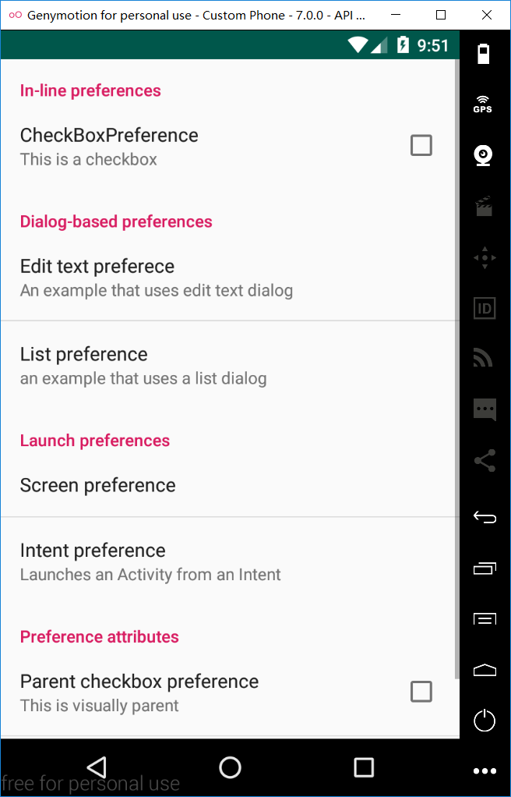
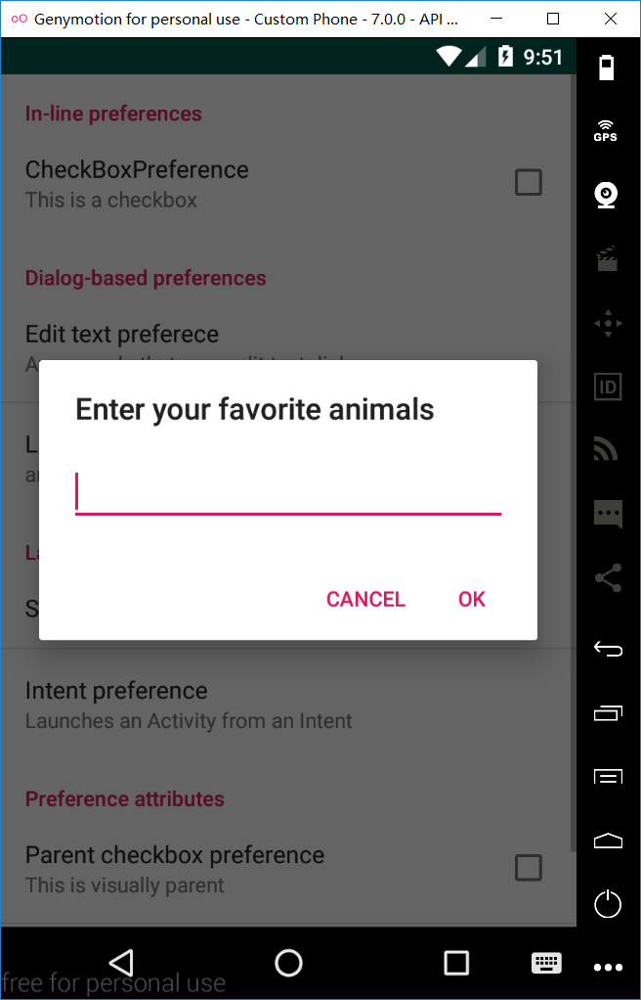
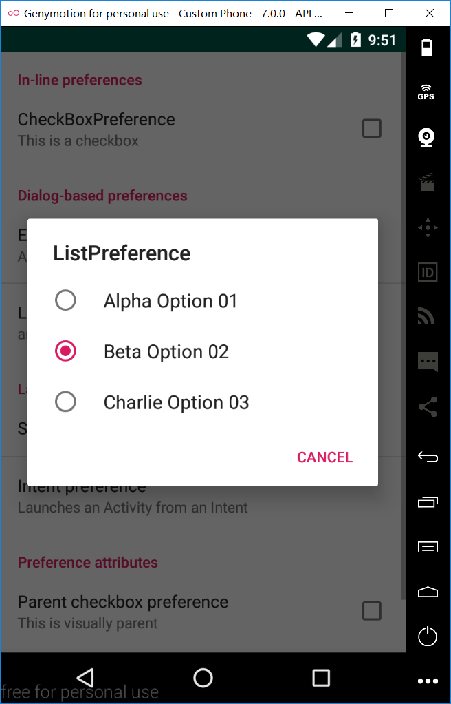
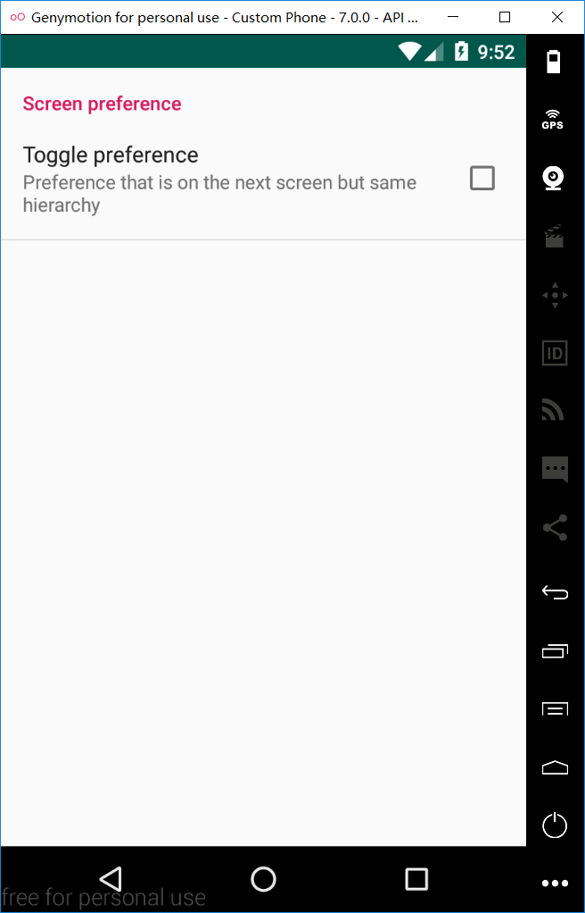
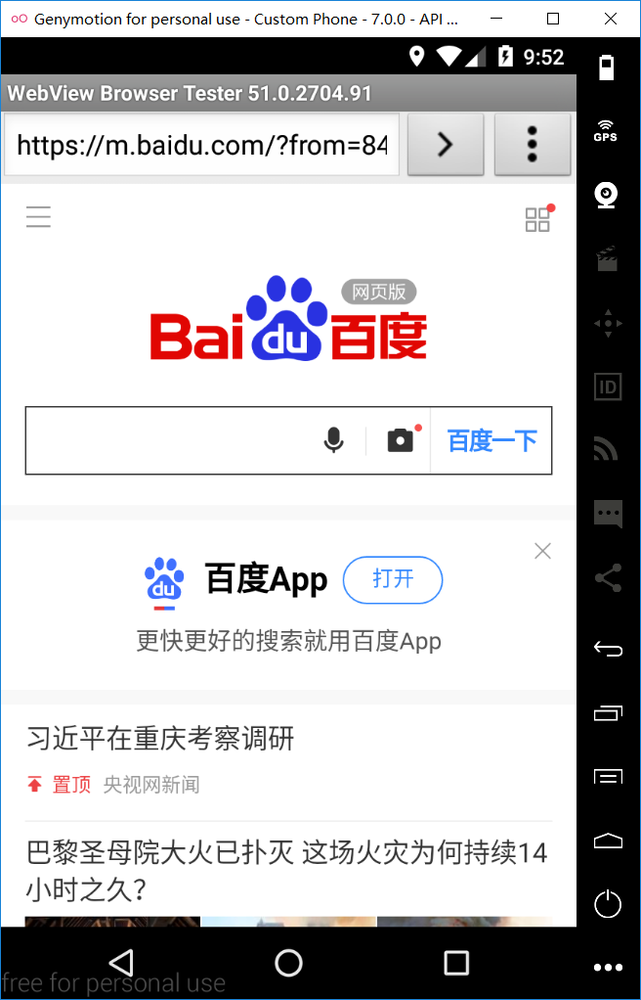
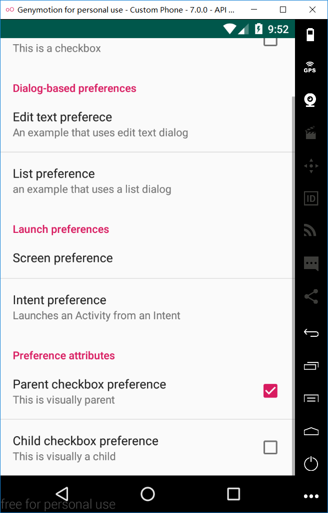

# Project_04
安卓移动开发实验4 - 扩展的Activity

程序主界面：


## 各种Preference截图：







### 关键代码
```
<?xml version="1.0" encoding="utf-8"?>
<PreferenceScreen xmlns:android="http://schemas.android.com/apk/res/android">
    <PreferenceCategory
        android:title="In-line preferences">
        <CheckBoxPreference
            android:key="checkbox_test"
            android:summary="This is a checkbox"
            android:title="CheckBoxPreference"
            android:defaultValue="false"/>
    </PreferenceCategory>
    <PreferenceCategory
        android:title="Dialog-based preferences">
        <EditTextPreference
            android:key="favorite_animals"
            android:title="Edit text preferece"
            android:summary="An example that uses edit text dialog"
            android:dialogTitle="Enter your favorite animals" />
        <ListPreference
            android:key="choose"
            android:title="List preference"
            android:summary="an example that uses a list dialog"
            android:dialogTitle="ListPreference"
            android:entries="@array/choose_one_list"
            android:entryValues="@array/choose_what_list"/>
    </PreferenceCategory>
    <PreferenceCategory
        android:title="Launch preferences">
        <PreferenceScreen android:title="Screen preference">
            <PreferenceCategory android:title="Screen preference">
                <CheckBoxPreference
                    android:key="toggle_test"
                    android:summary="Preference that is on the next screen but same hierarchy"
                    android:title="Toggle preference"
                    android:defaultValue="false"/>
            </PreferenceCategory>
        </PreferenceScreen>
        <Preference android:title="Intent preference"
            android:summary="Launches an Activity from an Intent">
            <intent android:action="android.intent.action.VIEW"
                android:data="http://www.baidu.com" />
        </Preference>
    </PreferenceCategory>
    <PreferenceCategory android:title="Preference attributes">
        <CheckBoxPreference
            android:key="parent_checkbox_preference"
            android:summary="This is visually parent"
            android:title="Parent checkbox preference" />
        <!-- 子类的可见类型是由样式属性定义的 -->
        <CheckBoxPreference
            android:dependency="parent_checkbox_preference"
            android:key="child_checkbox_preference"
            android:summary="This is visually a child"
            android:title="Child checkbox preference" />
    </PreferenceCategory>
</PreferenceScreen>
```
